<p align="center">
  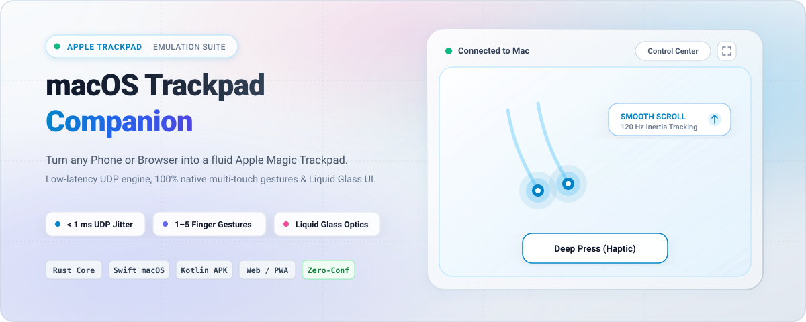
</p>

<p align="center">
  <a href="https://github.com/phxinyang/macos-trackpad-companion/releases"></a>
  
  
  <a href="LICENSE"></a>
</p>

<p align="center">
  <b>English</b> | <a href="README.zh-CN.md">简体中文</a>
</p>

---

**Trackpad Companion** is a high-precision multi-touch bridge crafted for macOS. It transforms your phone (native Android App or any mobile browser) and compatible Windows PTP (Precision Touchpad) devices into an authentic **Apple Magic Trackpad**.

Powered by a zero-allocation Rust gesture engine, it detects pointer movements, taps, momentum-assisted smooth scrolling, pinch-to-zoom, two-finger rotation, and full 3/4-finger macOS native gestures in real time (< 1ms UDP jitter), synthesizing corresponding system events on macOS.

> [!NOTE]
> This is a userspace bridge. It does not register as Apple's proprietary internal trackpad driver and cannot simulate Force Touch physical piezoelectric pressure levels. Public Quartz events offer broad application compatibility; private gestures (e.g. pinch, rotate) depend on macOS version and target application support.

---

## 📱 Cross-Platform Experience

<table>
  <tr>
    <td width="50%" align="center"><b>Android Native App (120Hz UDP)</b></td>
    <td width="50%" align="center"><b>Web Touchpad (Zero-Install Browser)</b></td>
  </tr>
  <tr>
    <td>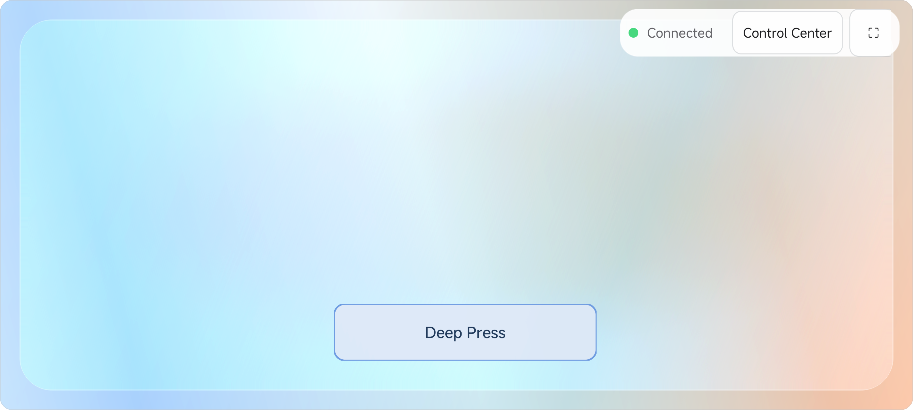</td>
    <td>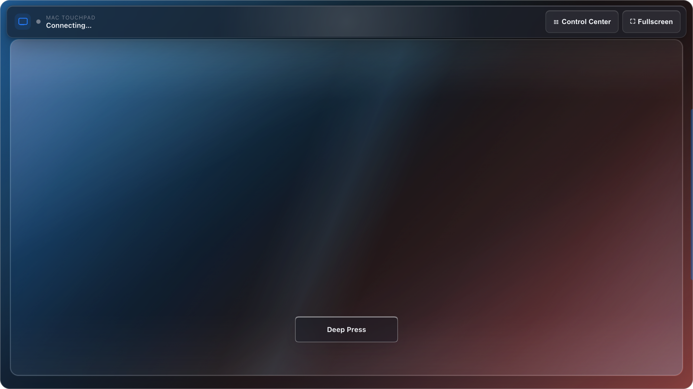</td>
  </tr>
  <tr>
    <td><b>Native Performance:</b> Sub-millisecond UDP streaming, custom haptic feedback, deep-press drag bar, and instant QR pairing.</td>
    <td><b>Universal Access:</b> Runs on any mobile or desktop browser via WebSockets without installing any application.</td>
  </tr>
</table>

---

## 🖥️ macOS Native Settings App

The native SwiftUI settings app provides intuitive controls, connection supervisors, and live synchronization with macOS system preferences:

<table>
  <tr>
    <td width="50%">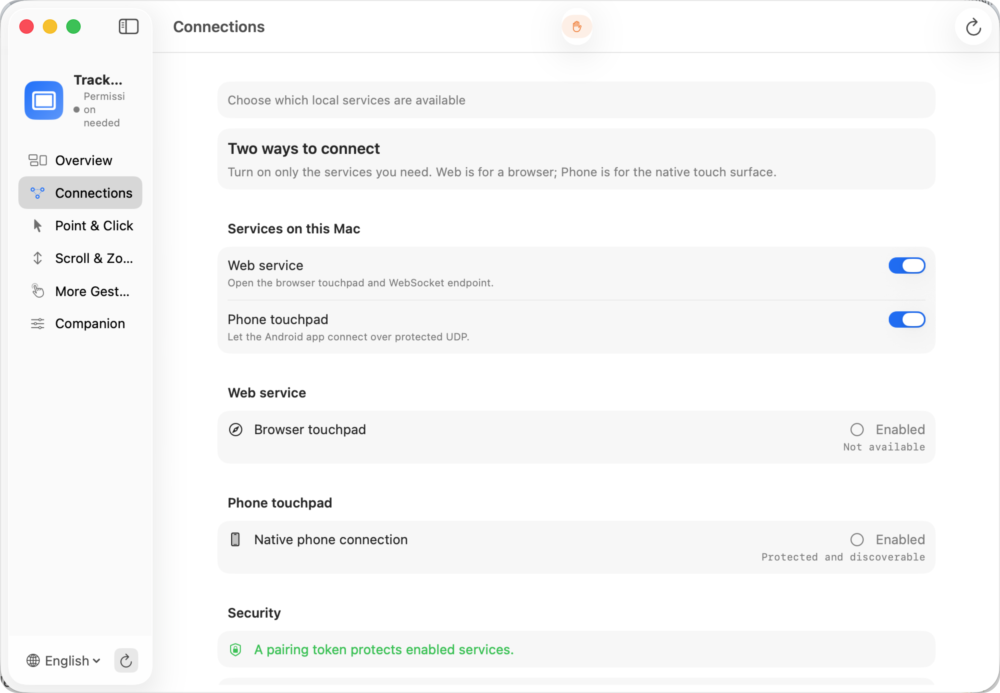</td>
    <td width="50%">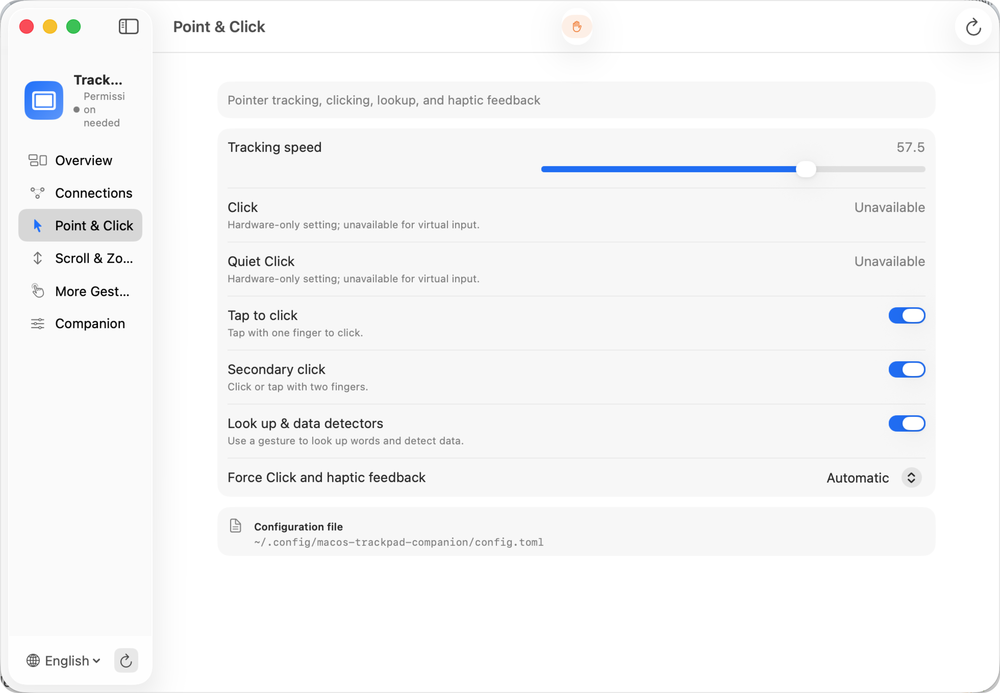</td>
  </tr>
  <tr>
    <td align="center"><b>Connections &amp; Network Channels</b></td>
    <td align="center"><b>Point &amp; Click / Tracking Speed</b></td>
  </tr>
  <tr>
    <td width="50%">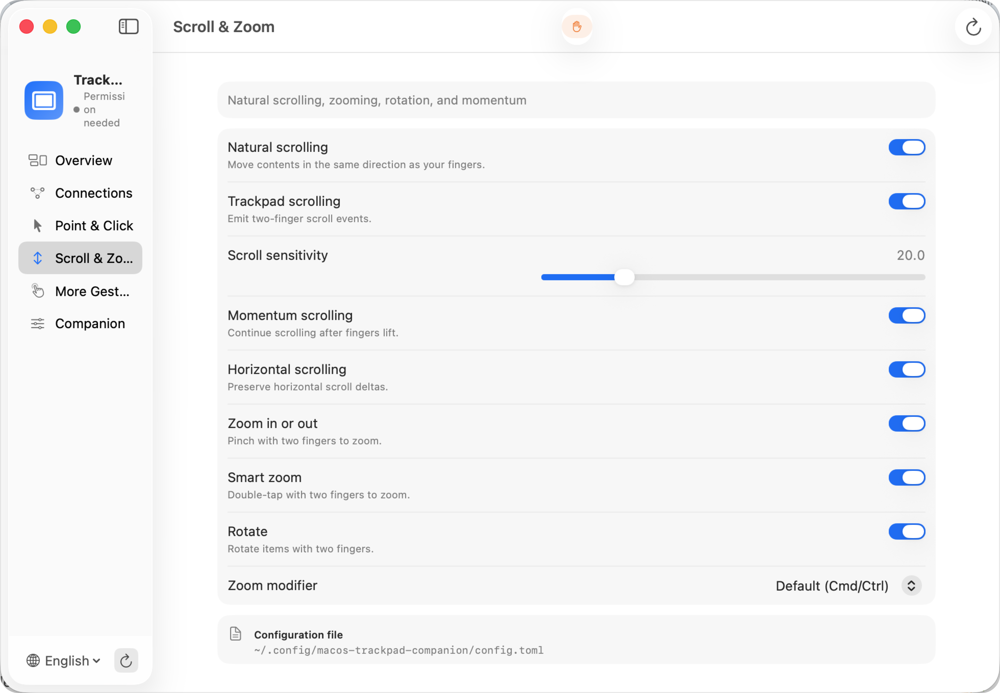</td>
    <td width="50%">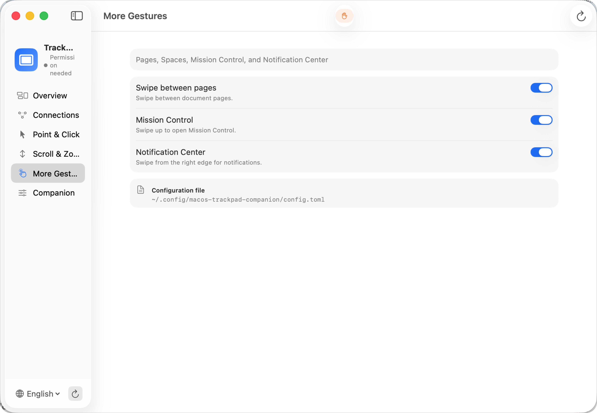</td>
  </tr>
  <tr>
    <td align="center"><b>Scroll Direction, Inertia &amp; Zoom</b></td>
    <td align="center"><b>Mission Control, Spaces &amp; System Gestures</b></td>
  </tr>
</table>

---

## 🎨 Liquid Glass Themes

Both the Android app and Web client feature GPU-accelerated **Liquid Glass** shaders with real-time chromatic aberration, refraction, and optical dispersion:

<table>
  <tr>
    <td width="33%" align="center">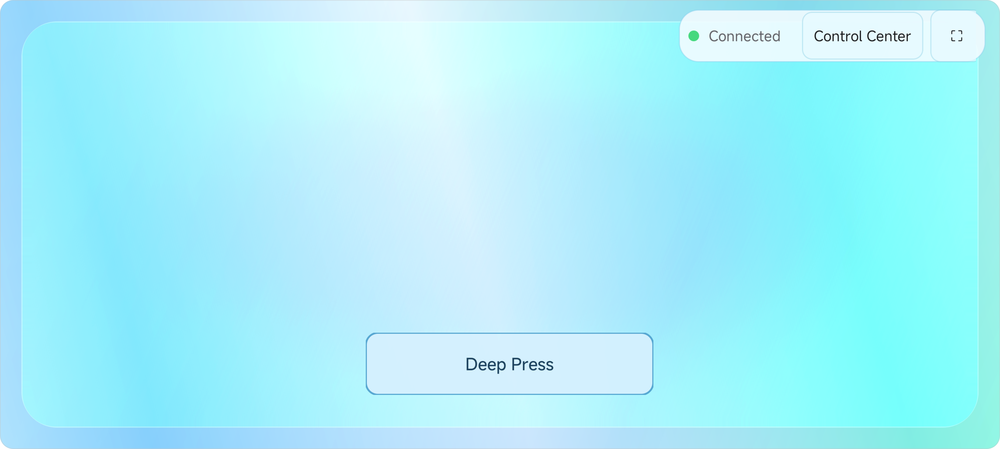<br><b>Ocean Glass</b></td>
    <td width="33%" align="center">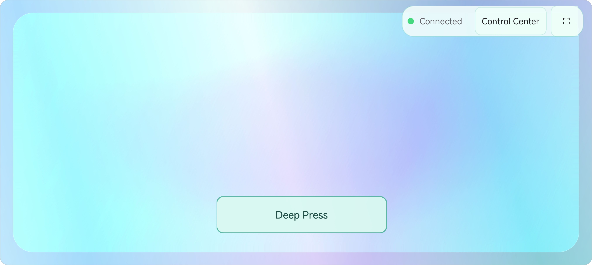<br><b>Aurora Glass</b></td>
    <td width="33%" align="center">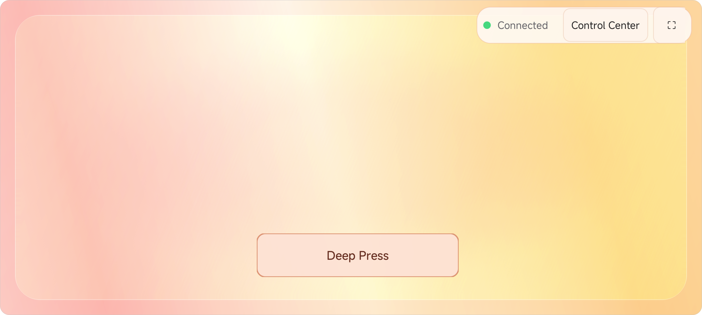<br><b>Sunset Glass</b></td>
  </tr>
</table>

---

## 🔍 Diagnostics & Advanced Tools

<table>
  <tr>
    <td width="50%">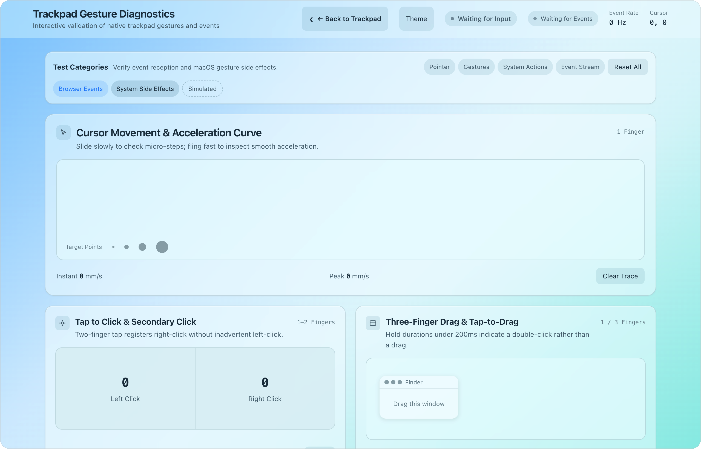</td>
    <td width="50%">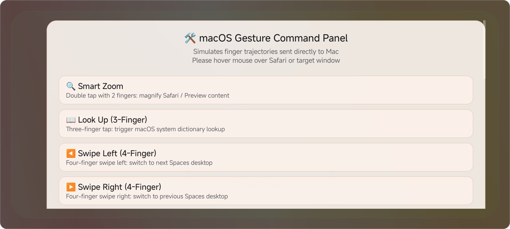</td>
  </tr>
  <tr>
    <td align="center"><b>Interactive Web Gesture Diagnostics</b></td>
    <td align="center"><b>Gesture Simulation &amp; Command Panel</b></td>
  </tr>
  <tr>
    <td width="50%">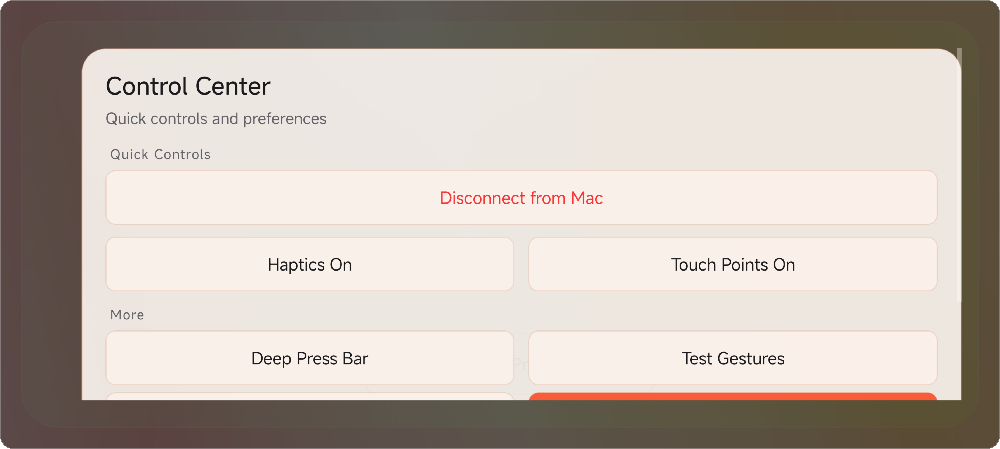</td>
    <td width="50%">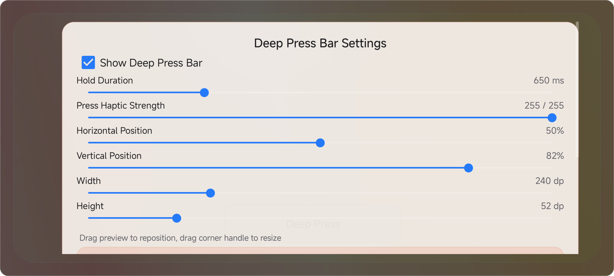</td>
  </tr>
  <tr>
    <td align="center"><b>Quick Control Center Drawer</b></td>
    <td align="center"><b>Deep Press Bar Haptic Calibration</b></td>
  </tr>
</table>

---

## Supported Surfaces & Features

| Client / Surface | Features & Capabilities | Required Permissions |
| --- | --- | --- |
| **macOS SwiftUI App** | Menu bar quick controls, daemon supervisor, QR pairing, and diagnostics | Accessibility |
| **Android Native App** | 120Hz low-latency touch surface, haptic feedback, deep-press bar, and QR pairing | Local Network & Camera (for QR scan) |
| **Web Touchpad (Browser)** | Zero-install touch surface (`http://<mac-ip>:4242/`) on any modern browser | Local Network |
| **USB PTP Daemon** | Direct HID digitizer communication for Windows Precision Touchpads | Input Monitoring + Accessibility |
| **TUI & CLI Tools** | Headless mode, SSH remote, Mac mini maintenance, and automation | None for config; daemon requires Accessibility |

The macOS app, TUI, and CLI share the same `companion-config` helper and Rust gesture engine, ensuring synchronized settings and consistent gesture behavior across all clients.

---

## Common Use Cases

### 1. Mac mini / Headless Mac (No Physical Trackpad)
Run the macOS app or `companion-net` to use full trackpad gestures from a phone or browser. macOS hides the system Trackpad settings pane when no physical trackpad is detected, and writing `defaults` cannot create virtual hardware. Trackpad Companion manages its own settings independently without intrusive system hacks.

### 2. Connect USB PTP Touchpad Hardware
Run `companion` to directly read HID digitizer input. The hardware must expose a standard Digitizer Touch Pad collection and contact descriptors. The decoder dynamically parses descriptors and bit-packed layouts at runtime (reference layout is 6 bytes per contact).

### 3. Zero-Install Instant Browser Experience
Start `companion-net` and open the printed URL on any mobile device on the same local network. This is the fastest way to test the gesture engine without installing any mobile application.

---

## macOS Installation Guide

Download the latest DMG installer from [GitHub Releases](https://github.com/phxinyang/macos-trackpad-companion/releases), open it, and drag `Trackpad Companion` to your `Applications` folder.

* **First Launch & Permissions**: On first launch, navigate to "Overview > Permissions" and click "Request Accessibility Permission". The built-in PermissionFlow module will open macOS "Privacy & Security > Accessibility" and guide you through authorization.
* **System Requirements**: macOS 13 or newer (the application bundle embeds all Rust network and configuration helpers).

---

## Build from Source

> [!TIP]
> Rust binaries depend on macOS system frameworks; please compile directly on your target Mac instead of copying Linux-built ELF binaries.

```sh
# Clone repository and build core engine
git clone https://github.com/phxinyang/macos-trackpad-companion.git
cd macos-trackpad-companion
cargo build --release
```

Run the HID hardware daemon:
```sh
./target/release/companion -v
```

Run the network listener daemon:
```sh
./target/release/companion-net -v
```

Build the native macOS SwiftUI app and DMG installer:
> The current PermissionFlow dependency requires Swift 6.2 (Xcode 16 or newer).

```sh
./packaging/macos/build-app.sh
./packaging/macos/package-dmg.sh
open dist/macos/Trackpad-Companion-*-macos.dmg
```

The app bundle packages `companion-net`, `companion-config`, and localization assets into `Contents/Resources`, eliminating any Homebrew dependency for end users.

---

## Connect Phone & Clients

The macOS app's **Connections** page provides two independent switches:
* **Web Access**: Opens the browser touch interface and WebSocket service over TCP.
* **Phone Access**: Opens the high-frequency touch channel over UDP and advertises Bonjour (mDNS) pairing services.

### Recommended Connection Flow

1. **Choose Channel**: In the Mac menu bar or Settings "Connections" page, enable the desired channels (both enabled by default).
2. **Android App QR Pairing**:
   * Open the Android App and tap "Scan QR Code".
   * Scan the pairing QR code on the Mac screen. Mac IP, port, and pairing token are automatically resolved for low-latency connection (all data stays strictly on your local LAN).
   * *Fallback Connection*: If the camera is unavailable, select "IP Connection (Backup)" in the app to enter Mac IP, port, and token manually.
3. **Instant Browser Access**:
   * Copy the Web URL displayed on the Mac (e.g. `http://192.168.1.100:4242/?token=...`) into any mobile browser.

### Protocol Probes & Automated Testing

Use the built-in Python test probes to test protocol streams, gesture responses, and CI automation directly:

```sh
# Simulate contact displacement motion
python3 tools/synthetic_sender.py --host 127.0.0.1 --mode circle
# Simulate two-finger scrolling
python3 tools/ws_probe.py --host 127.0.0.1 --mode scroll
# Visually verify gestures step-by-step on macOS
python3 tools/gesture_probe.py
```

*If the UDP listener has authentication enabled, append `--token <your-token>` to the probe command.*

---

## Security & Permissions

Because network listeners can synthesize mouse and keyboard events on your Mac, security is paramount:

```sh
# Generate a random pairing token and inspect config
./target/release/companion-config ensure-token
./target/release/companion-config dump
```

* **Tokenless Protection**: Without a configured token, `companion-net` **strictly binds to `127.0.0.1` loopback only**; attempting an explicit non-loopback bind (e.g. `0.0.0.0`) is **actively rejected at startup** to prevent unauthorized network exposure.
* **Token-Protected LAN**: With a configured token, the listener defaults to `0.0.0.0`, allowing authenticated LAN clients to connect.
* **Redaction Policy**: Pairing links and tokens act as access keys. Diagnostic scripts automatically redact sensitive credentials when generating logs. See [SECURITY.md](SECURITY.md).

---

## Configuration Manual

Default configuration path:
```text
$XDG_CONFIG_HOME/macos-trackpad-companion/config.toml
# If the environment variable is unset, falls back to: ~/.config/macos-trackpad-companion/config.toml
```

Missing configuration files automatically use default parameters. Interactive configuration via GUI or TUI is recommended, or use the CLI helper:

```sh
# View parsed configuration
./target/release/companion-config dump
# Adjust pointer sensitivity
./target/release/companion-config set --path cursor.sensitivity --value 28
# Run configuration and environment diagnostics
./target/release/companion-config doctor
```

Compact configuration example:

```toml
[net]
port = 4242
web_enabled = true
phone_enabled = true
# token = "your-pairing-token" # Required for non-loopback LAN listening

[cursor]
sensitivity = 28.0
accel_exponent = 1.35
accel_ref = 70.0

[scroll]
sensitivity = 20.0
natural = true       # Natural scroll direction
horizontal = true    # Two-finger horizontal scroll
momentum = true      # Momentum inertia deceleration

[macos]
sync_system_settings = true
haptic_feedback = "auto" # auto | on | off

[gestures]
tap_to_click = "on"
secondary_click = "on"
smart_zoom = "on"
dictionary_lookup = "on"
right_edge_swipe = "on"
parameter_profile = "native" # native | chromium_os
surface_width_mm = 65.0

[gestures.pinch]
enable = "on"
gain = 1.0

[gestures.rotate]
enable = "on"
gain = 1.0

[gestures.three_finger_drag]
enable = "on"
persistent_drag_lock = true
release_delay_ms = 500
```

For complete field specifications, per-application policies, and swipe backend options, see [docs/configuration.md](docs/configuration.md).

---

## Native Gestures Guide

- **1-Finger Gestures**:
  - **Pointer Movement**: Linear tracking with macOS-like acceleration curve.
  - **Click Actions**: Tap to Click, Double Click, Tap-to-Drag, and Press-and-Hold Drag.
- **2-Finger Gestures**:
  - **Smooth Scrolling**: High-precision 2D phased scrolling (natural/inverted, momentum inertia decay, Shift horizontal scroll remap).
  - **Pinch & Rotate**: Pinch to Zoom and Two-Finger Rotation (compatible with AppKit, Safari, and creative apps).
  - **Edge Swipe**: Inward swipe from right edge to toggle macOS Notification Center (Right-Edge Swipe).
  - **Smart Zoom**: Double-tap with two fingers to magnify or reset web content (Smart Zoom).
- **3-Finger Gestures**:
  - **Three-Finger Drag**: Jitter-filtered left-button drag, supporting `persistent_drag_lock` (carry a drag across fullscreen Spaces).
  - **Three-Finger Tap**: Dictionary lookup and data detectors.
- **4-Finger Gestures**:
  - **Swipe Up**: Open Mission Control.
  - **Swipe Down**: Open App Exposé.
  - **Swipe Left / Right**: Smooth switching between fullscreen Spaces and Desktops.
  - **Radial Pinch In (4-Finger Collapse)**: Open Launchpad.
  - **Radial Spread Out (4-Finger Expand)**: Show Desktop.
- **Physical Modifier Keys Passthrough**:
  - Control, Option, Command, and Shift modifiers are merged into mouse, scroll, zoom, and rotate event streams in real time.


---

## Diagnostics & Development

```sh
# Run configuration and environment doctor check
./target/release/companion-config doctor
# Launch terminal interactive TUI
./target/release/companion-tui
# Collect read-only diagnostics report (app state, permissions, processes, ports)
./scripts/diagnose-mac.sh collect
# Probe port 4242 and network reachability
./scripts/diagnose-mac.sh probe --port 4242
# Run foreground live trace capture
./scripts/diagnose-mac.sh trace --port 4242
```

Run the complete test suite before submitting code:
```sh
cargo test --workspace
cargo check --all-targets
```


---

## Repository Map

| Directory | Responsibility |
| --- | --- |
| `src/` | Core Rust daemon, network listener, gesture state machine, and macOS event output |
| `crates/touchpad-proto/` | Shared ATP1 touch protocol encoder and decoder |
| `macos/TrackpadCompanionSettings/` | Native macOS SwiftUI settings app and menu bar supervisor |
| `android/` | Android native 120Hz touch client and test suites |
| `static/` | Web touch surface with GPU-accelerated liquid glass and test page |
| `packaging/macos/` | macOS app packaging, code signing, and DMG installer scripts |
| `docs/` | Architecture design, wire protocols, configuration manuals, and research notes |
| `tools/` | Protocol probes and deterministic synthetic touch senders |

---

## License

This project is licensed under the [MIT License](LICENSE).

The macOS settings app includes [PermissionFlow](https://github.com/jaywcjlove/PermissionFlow) via SwiftPM under its [MIT License](https://github.com/jaywcjlove/PermissionFlow/blob/v2.11.2/LICENSE). Third-party research references and asset origins are documented under `docs/` and `static/assets/`.
