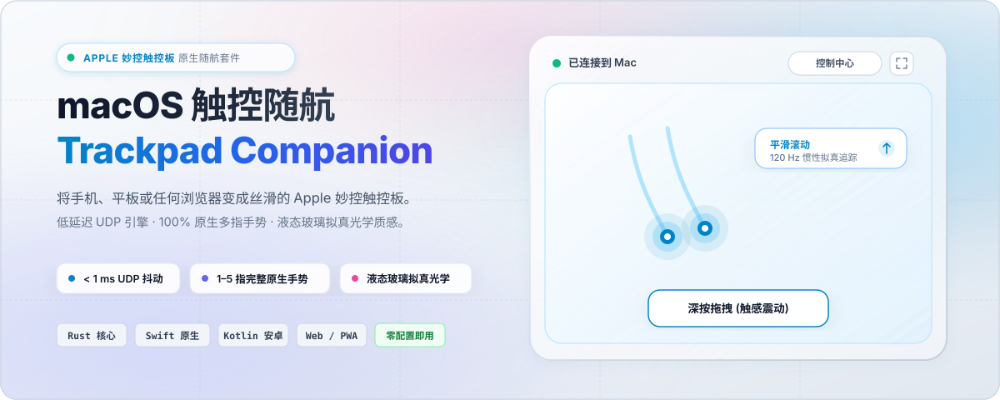
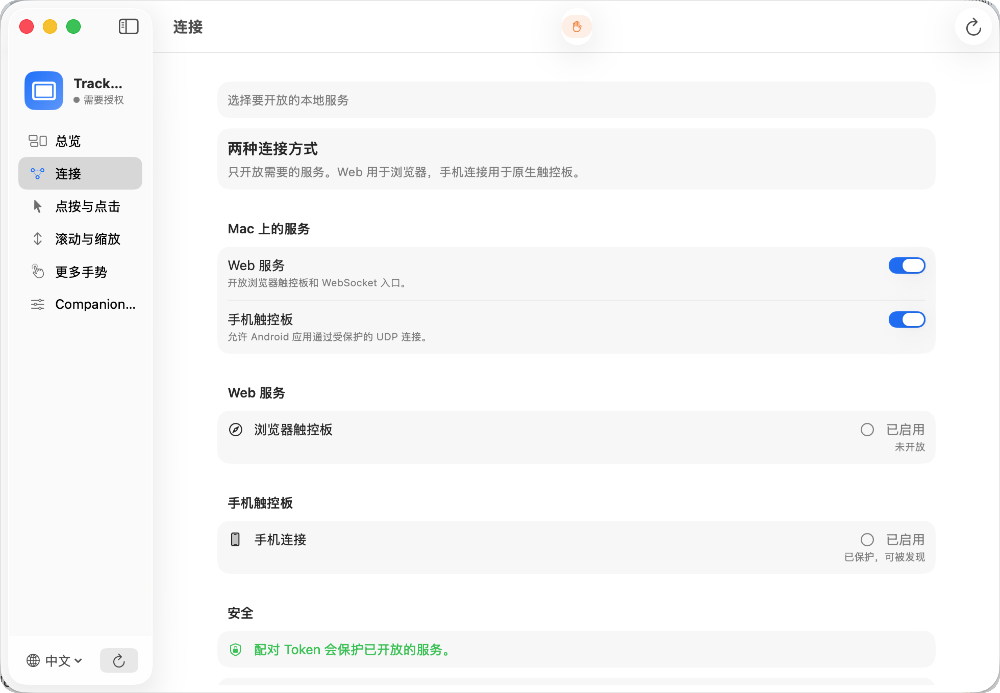
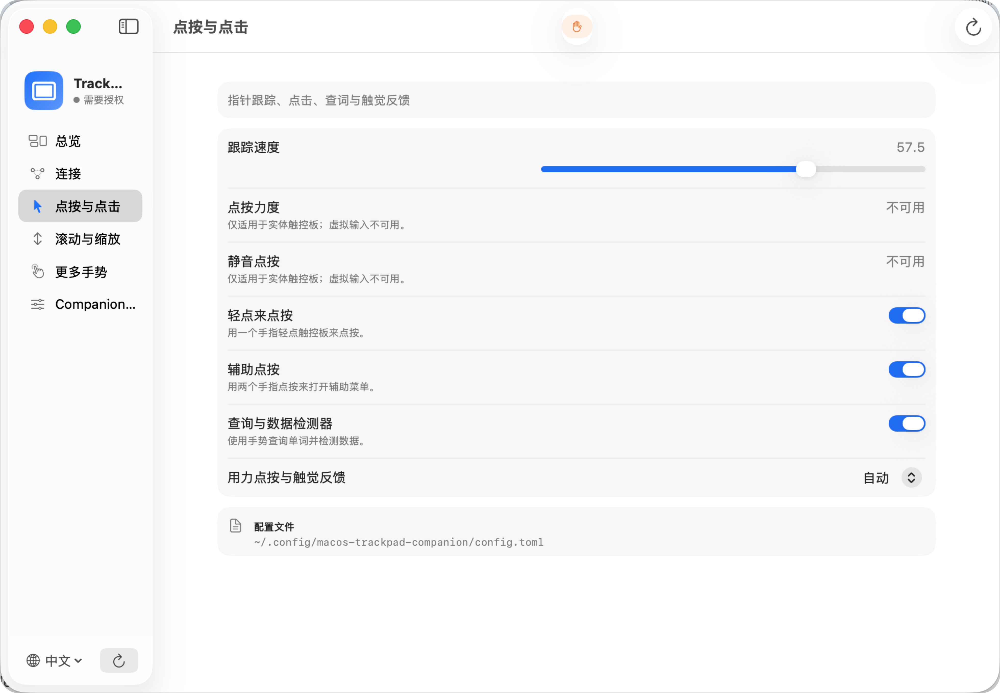
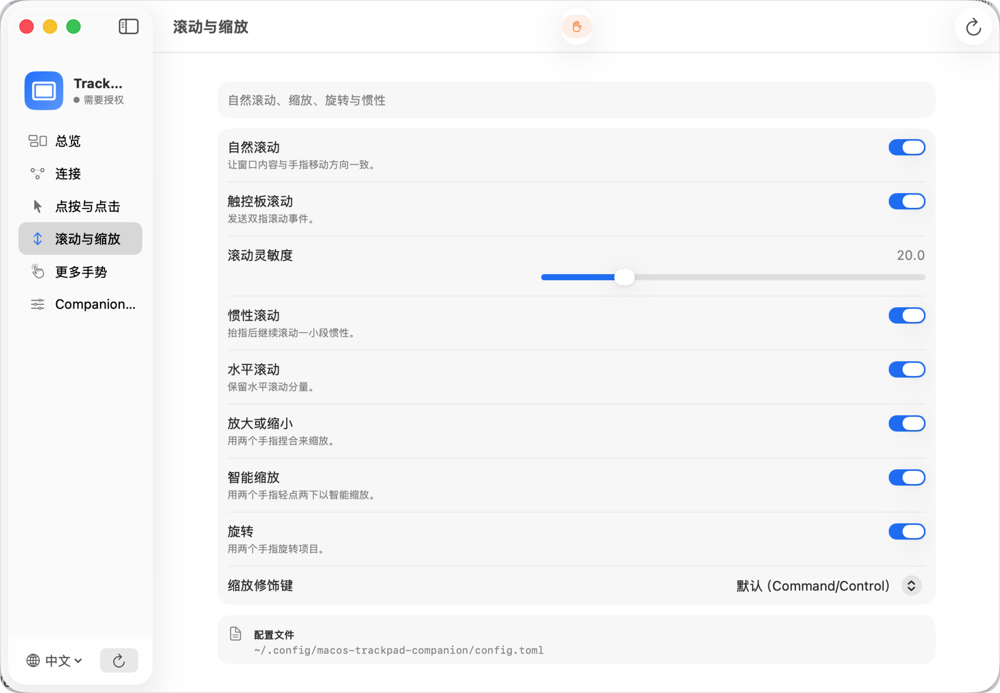
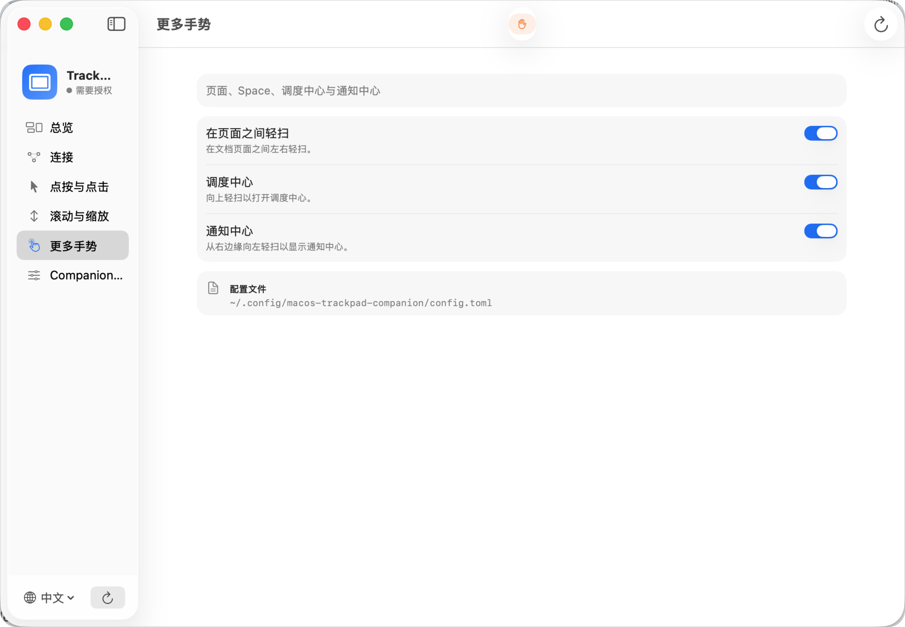

<p align="center">
  
</p>

<p align="center">
  <a href="https://github.com/phxinyang/macos-trackpad-companion/releases"></a>
  
  
  <a href="LICENSE"></a>
</p>

<p align="center">
  <a href="README.md">English</a> | <b>简体中文</b>
</p>

---

**Trackpad Companion（触控随航）** 是一款专为 macOS 打造的高精度多点触控板桥接套件。它可以将你的手机（Android 原生 App 或任何移动端浏览器）以及兼容的 Windows PTP（精确式触控板）设备，变成体验高度还原的 **Apple 妙控触控板**。

内置零内存分配的 Rust 高精度手势引擎，支持实时识别指针移动、轻点、带惯性的平滑滚动、捏合缩放、双指旋转以及完整的三指/四指原生手势（UDP 抖动 < 1ms），并在 macOS 系统层合成对应的原生事件。

> [!NOTE]
> 本项目为运行在用户态的系统桥接工具。它不会注册为 Apple 私有的内部触控板驱动，也不支持 Force Touch 物理压感模拟。公开 Quartz 事件具备极佳的应用兼容性；私有手势事件（如捏合、旋转）的效果取决于具体的 macOS 系统版本和目标应用。

---

## 📱 跨端触控体验

<table>
  <tr>
    <td width="50%" align="center"><b>Android 原生 App (120Hz UDP)</b></td>
    <td width="50%" align="center"><b>网页端触控板 (Web 即开即用)</b></td>
  </tr>
  <tr>
    <td></td>
    <td></td>
  </tr>
  <tr>
    <td><b>原生极致性能：</b>亚毫秒级 UDP 高频触控流、原生震动触感反馈、深按拖拽条与扫码瞬时配对。</td>
    <td><b>零安装通用访问：</b>任何手机、平板或电脑浏览器通过 WebSocket 直接使用，无需安装任何客户端。</td>
  </tr>
</table>

---

## 🖥️ macOS 原生设置套件

基于 SwiftUI 开发的原生设置界面，提供直观的通道管理、服务守护与系统级触控板参数同步：

<table>
  <tr>
    <td width="50%"></td>
    <td width="50%"></td>
  </tr>
  <tr>
    <td align="center"><b>连接通道管理与二维码配对</b></td>
    <td align="center"><b>点按与点击 / 跟踪速度与查词</b></td>
  </tr>
  <tr>
    <td width="50%"></td>
    <td width="50%"></td>
  </tr>
  <tr>
    <td align="center"><b>自然滚动方向、平滑惯性与缩放</b></td>
    <td align="center"><b>调度中心、空间切换与系统手势</b></td>
  </tr>
</table>

---

## 🎨 液态玻璃光学主题

Android 原生 App 与 Web 客户端均内置 GPU 加速的**液态玻璃（Liquid Glass）**着色器，呈现拟真色散、折射与高光光学质感：

<table>
  <tr>
    <td width="33%" align="center"><br><b>海洋玻璃 (Ocean Glass)</b></td>
    <td width="33%" align="center"><br><b>极光玻璃 (Aurora Glass)</b></td>
    <td width="33%" align="center"><br><b>日落玻璃 (Sunset Glass)</b></td>
  </tr>
</table>

---

## 🔍 诊断面板与高级工具

<table>
  <tr>
    <td width="50%"></td>
    <td width="50%"></td>
  </tr>
  <tr>
    <td align="center"><b>Web 端原生手势交互诊断台</b></td>
    <td align="center"><b>手势模拟与动作指令控制台</b></td>
  </tr>
  <tr>
    <td width="50%"></td>
    <td width="50%"></td>
  </tr>
  <tr>
    <td align="center"><b>移动端快捷控制中心抽屉</b></td>
    <td align="center"><b>深按触控条与触感震动校准</b></td>
  </tr>
</table>

---

## 支持端与特性

| 客户端 / 接入方式 | 功能与特性 | 所需权限 |
| --- | --- | --- |
| **macOS SwiftUI 客户端** | 菜单栏快捷控制、服务守护、二维码配对与系统诊断 | 辅助功能 (Accessibility) |
| **Android 原生 App** | 120Hz 低延迟触控、触觉震动反馈、深按条与扫码配对 | 仅需局域网与相机（扫码） |
| **网页端触控板 (Web)** | 浏览器即开即用（访问 `http://<mac-ip>:4242/`），无需安装 | 仅需局域网 |
| **USB PTP 守护进程** | 直接读取兼容的 Windows 精确式触控板硬件 | 输入监控 + 辅助功能 |
| **TUI 与 CLI 工具** | 支持无头模式、SSH 远程、Mac mini 运维与脚本自动化 | 配置修改无需权限；后台运行需辅助功能 |

macOS 客户端、TUI 与命令行均共用同一个 `companion-config` 工具和相同的 Rust 手势引擎，确保多端配置始终同步、手势表现完全一致。

---

## 典型使用场景

### 1. Mac mini / 桌面 Mac（无实体触控板）
安装 macOS 原生应用或运行 `companion-net`，即可配合手机或浏览器直接使用完整手势。macOS 在未检测到实体触控板时会隐藏系统的“触控板”偏好设置面板，直接写入 `defaults` 也无法生成虚拟硬件。Trackpad Companion 自带独立完整的配置管理，无需对系统进行复杂的侵入式修改。

### 2. 连接 USB PTP 触控板硬件
直接运行 `companion` 即可接管 HID 触控板。设备需提供标准 Digitizer Touch Pad 集合与触点描述符；解码器支持运行时动态解析描述符及位打包结构（默认参考配置为每触点 6 字节）。

### 3. 免安装浏览器极速体验
启动 `companion-net` 后，在同一局域网下的手机或平板浏览器中打开提示的 URL 即可开始使用。这是最快体验手势引擎的方式，无需安装任何移动端 App。

---

## macOS 安装指南

从 [GitHub Releases](https://github.com/phxinyang/macos-trackpad-companion/releases) 下载最新的 DMG 安装包，打开后将 `Trackpad Companion` 拖入 `Applications` 目录即可。

* **首次启动与权限引导**：打开应用后，进入「总览 > 权限」，点击「请求辅助功能权限」。内置的 PermissionFlow 模块会自动打开系统「隐私与安全性 > 辅助功能」设置页，并引导完成授权。
* **系统要求**：支持 macOS 13 及更高版本（二进制已内置所有 Rust 网络与配置 helper）。

---

## 从源码构建

> [!TIP]
> Rust 二进制文件依赖 macOS 本地系统库，请在目标 Mac 上直接编译，请勿将 Linux 构建的 ELF 产物直接复制到 macOS。

```sh
# 克隆仓库并编译核心引擎
git clone https://github.com/phxinyang/macos-trackpad-companion.git
cd macos-trackpad-companion
cargo build --release
```

运行 HID 硬件守护进程：
```sh
./target/release/companion -v
```

运行网络监听服务：
```sh
./target/release/companion-net -v
```

构建 macOS 原生 SwiftUI 应用与 DMG 安装包：
> 当前 PermissionFlow 依赖需要 Swift 6.2（Xcode 16 或更高版本）。

```sh
./packaging/macos/build-app.sh
./packaging/macos/package-dmg.sh
open dist/macos/Trackpad-Companion-*-macos.dmg
```

应用包会将 `companion-net`、`companion-config` 及本地化资源打包至 `Contents/Resources`，无需用户单独配置 Homebrew 环境。

---

## 连接手机与客户端

macOS 客户端的「连接」页面提供两个独立的通道开关：
* **网页端访问 (Web)**：通过 TCP 开放网页触控板与 WebSocket 服务；
* **手机端访问 (Phone)**：通过 UDP 提供高频触控通道，并通过 Bonjour（mDNS）广播配对服务。

### 推荐连接流程

1. **选择通道**：在 Mac 菜单栏或设置的「连接」页面中，打开所需的通道开关（默认均开启）。
2. **手机 App 扫码连接**：
   * 打开 Android App，点击「扫描二维码」；
   * 对准 Mac 屏幕上的配对二维码扫码，Mac IP、端口和配对 Token 会自动解析并完成低延迟连接（全流程仅在本地局域网完成，不经过任何云端）。
   * *备用连接*：若无法使用相机，可在 App 连接页选择「IP 连接（备用）」，手动输入 Mac IP、端口与 Token。
3. **浏览器即开即用**：
   * 复制 macOS 界面上显示的 Web 地址（如 `http://192.168.1.100:4242/?token=...`），直接在手机浏览器中打开即可。

### 协议探针与自动化测试

可以使用内置的 Python 探针在本地直接测试协议数据流与手势响应，或用于 CI 自动化验证：

```sh
# 模拟触点位移轨迹
python3 tools/synthetic_sender.py --host 127.0.0.1 --mode circle
# 模拟双指滚动
python3 tools/ws_probe.py --host 127.0.0.1 --mode scroll
# 在 Mac 上逐项触发手势并目视确认效果
python3 tools/gesture_probe.py
```

*如果 UDP 监听服务启用了鉴权，在测试命令末尾追加 `--token <your-token>` 即可。*

---

## 安全与权限控制

由于网络触控服务可以在 Mac 上合成鼠标与键盘事件，安全性至关重要：

```sh
# 生成随机配对 Token 并检查配置
./target/release/companion-config ensure-token
./target/release/companion-config dump
```

* **无 Token 安全限制**：未配置 Token 时，`companion-net` **严格仅监听 `127.0.0.1` 本地回环**；尝试显式监听非回环地址（如 `0.0.0.0`）会在**启动阶段主动拒绝**，防止未授权网络暴露。
* **Token 局域网接入**：配置 Token 后，服务默认监听 `0.0.0.0`，允许已鉴权的局域网客户端接入。
* **脱敏策略**：配对链接与 Token 为鉴权凭据，诊断脚本在生成日志时会自动脱敏敏感字段。详情请见 [SECURITY.md](SECURITY.md)。

---

## 配置手册

默认配置文件路径：
```text
$XDG_CONFIG_HOME/macos-trackpad-companion/config.toml
# 若环境变量未设置，则默认回退到：~/.config/macos-trackpad-companion/config.toml
```

配置文件缺失时会自动使用默认参数。推荐通过图形界面或 TUI 交互式配置，也可使用命令行工具直接调整：

```sh
# 查看已解析配置
./target/release/companion-config dump
# 调整光标灵敏度
./target/release/companion-config set --path cursor.sensitivity --value 28
# 运行配置与环境诊断
./target/release/companion-config doctor
```

精简配置示例：

```toml
[net]
port = 4242
web_enabled = true
phone_enabled = true
# token = "your-pairing-token" # 监听非回环局域网时必填

[cursor]
sensitivity = 28.0
accel_exponent = 1.35
accel_ref = 70.0

[scroll]
sensitivity = 20.0
natural = true       # 自然滚动方向
horizontal = true    # 双指横向滚动
momentum = true      # 惯性减速衰减

[macos]
sync_system_settings = true
haptic_feedback = "auto" # auto | on | off

[gestures]
tap_to_click = "on"
secondary_click = "on"
smart_zoom = "on"
dictionary_lookup = "on"
right_edge_swipe = "on"
parameter_profile = "native" # native | chromium_os
surface_width_mm = 65.0

[gestures.pinch]
enable = "on"
gain = 1.0

[gestures.rotate]
enable = "on"
gain = 1.0

[gestures.three_finger_drag]
enable = "on"
persistent_drag_lock = true
release_delay_ms = 500
```

完整字段规范、各应用专属规则与轻扫后端选项请参阅 [docs/configuration.md](docs/configuration.md)。

---

## 原生手势指南

- **单指手势**：
  - **指针移动**：线性跟踪与 macOS 加速度曲线平滑拟合。
  - **点按动作**：轻点点按 (Tap to Click)、双击、轻点拖移 (Tap-to-Drag) 与单指长按拖拽 (Press-and-Hold Drag)。
- **双指手势**：
  - **平滑滚动**：高精度 2D 分阶段滚动（支持自然/反向方向、动量惯性衰减与 Shift 横滚映射）。
  - **缩放与旋转**：捏合缩放 (Pinch-to-Zoom) 与双指旋转（兼容 AppKit、Safari 与创作类应用）。
  - **边缘滑入**：右边缘向内轻扫唤出 macOS 通知中心 (Right-Edge Swipe)。
  - **智能缩放**：双指双击放大或重置网页内容 (Smart Zoom)。
- **三指手势**：
  - **三指拖移**：带抖动抑制的左键拖拽，支持 `persistent_drag_lock`（跨全屏桌面 Space 拖动窗口）。
  - **三指轻点**：系统词典查询与数据检测器。
- **四指手势**：
  - **向上轻扫**：打开调度中心 (Mission Control)。
  - **向下轻扫**：打开 App Exposé。
  - **左右轻扫**：在全屏桌面与 Space 之间平滑切换。
  - **向内捏合 (四指聚合)**：打开启动台 (Launchpad)。
  - **向外张开 (四指张开)**：显示桌面 (Show Desktop)。
- **物理修饰键穿透**：
  - Control、Option、Command 与 Shift 修饰键实时注入鼠标、滚动、缩放与旋转事件流。


---

## 诊断与开发

```sh
# 运行配置与环境 doctor 诊断检查
./target/release/companion-config doctor
# 启动终端交互式 TUI
./target/release/companion-tui
# 收集只读诊断报告（应用状态、权限、进程、端口）
./scripts/diagnose-mac.sh collect
# 探测 4242 端口与网络连通性
./scripts/diagnose-mac.sh probe --port 4242
# 运行前台实时 trace 抓取
./scripts/diagnose-mac.sh trace --port 4242
```

提交代码前请运行完整测试套件：
```sh
cargo test --workspace
cargo check --all-targets
```

---

## 发布版本

推送版本 tag 会触发构建一个包含经签名的 Android APK/AAB、Developer ID 签名及公证的 macOS DMG/ZIP、自动生成的 Release Notes 以及 `SHA256SUMS` 的 GitHub Release。签名密钥严格保存在 GitHub Actions Secrets 中。详情请见 [docs/releasing.md](docs/releasing.md)。

---

## 仓库结构

| 目录 | 职责 |
| --- | --- |
| `src/` | Rust 核心守护进程、网络监听器、手势状态机与 macOS 事件输出 |
| `crates/touchpad-proto/` | 共享 ATP1 触控协议编解码库 |
| `macos/TrackpadCompanionSettings/` | 原生 macOS SwiftUI 设置应用与菜单栏守护 |
| `android/` | Android 原生 120Hz 触控客户端与测试套件 |
| `static/` | GPU 加速液态玻璃网页触控板与诊断测试页 |
| `packaging/macos/` | macOS 应用打包、代码签名与 DMG 制作脚本 |
| `docs/` | 架构设计、传输协议、配置手册与研究记录 |
| `tools/` | 协议探针与确定性虚拟触点生成工具 |

---

## 开源协议

本项目采用 [MIT License](LICENSE) 开源协议。

macOS 设置应用通过 SwiftPM 引入了 [PermissionFlow](https://github.com/jaywcjlove/PermissionFlow)（采用 [MIT License](https://github.com/jaywcjlove/PermissionFlow/blob/v2.11.2/LICENSE)）。第三方研究参考与资产来源详见 `docs/` 与 `static/assets/`。
